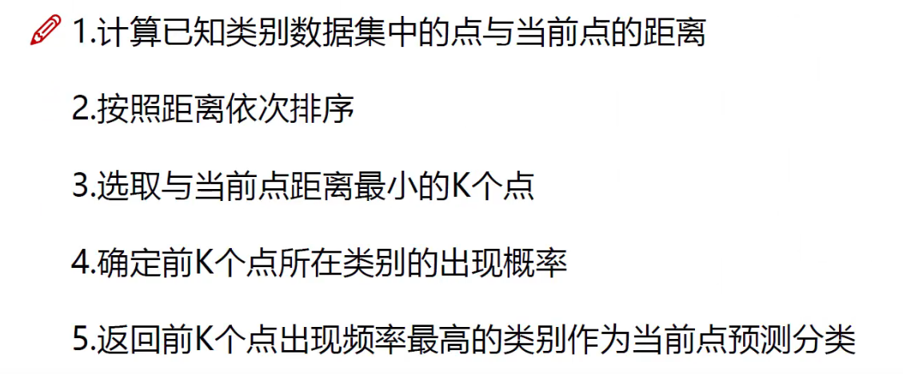
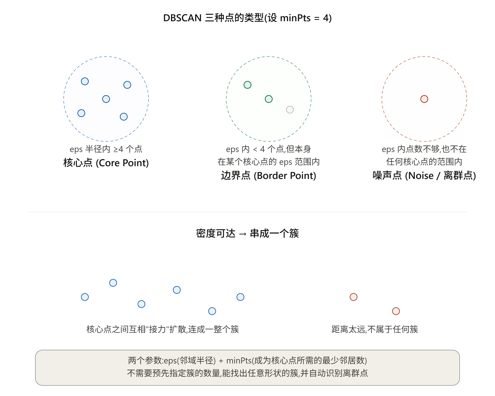
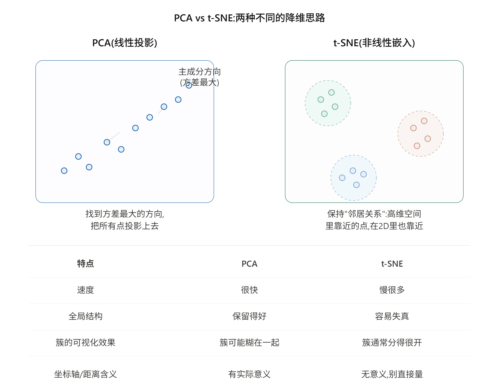
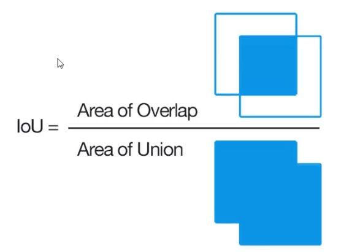
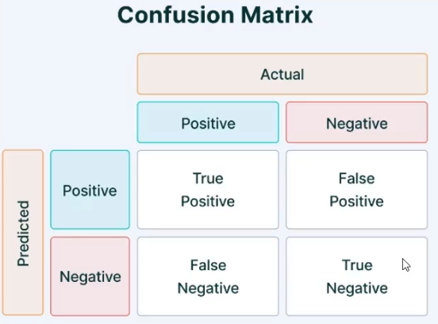
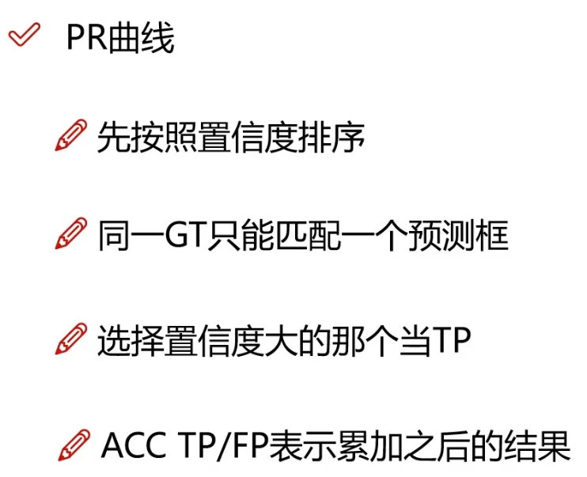

# 计算机视觉

大部分内容跟神经网络是一样的，补充一下一些概念

## 卷积
开运算：先腐蚀后膨胀（去噪）
闭运算：先膨胀后腐蚀（噪声更明显）

Sobel算子
scharr算子
laplacian算子

模板匹配
## 直方图
直方图均衡化

## 傅里叶变换
- 离散傅里叶变换
  $$X[k]=\sum_{n=0}^{N-1} x[n] \cdot e^{-j \frac{2 \pi}{N} k n}$$
- 快速傅里叶变换

低通滤波和高通滤波

## 聚类算法

k近邻算法 KNN

DBSCAN 

PCA/t-SNE 可视化

## 物体检测评估指标

IoU：GT与预测的差异 

TP:置信度和IoU都满足阈值

准确率：预测的所有数据中正确的概率

$$ Precision = \frac{TP}{TP+FP}$$

召回率：所有原有数据中正确预测的概率

$$ Recall = \frac{TP}{TP+FN}$$

阈值高，准确率高，召回率低（宁缺毋滥）

P-R曲线

AP：P-R曲线的面积

包络线原则：如果模型 A 的 P-R 曲线完全包围了模型 B 的曲线（即 A 的 Precision 在每个 Recall 下都高于 B），则 A 绝对优于 B。
AP 值越高，模型性能越好。

ROC 曲线（召回率：误报率）对正负样本比例不敏感。当负样本大量增加时，ROC 曲线往往能保持漂亮的外形（因为 FP（假正例）增加，但 FN（假负例）不变时，TPR（真正例率）不变，FPR（假正例率）只是微小增加）。

$$ FPR = \frac{FP}{FP+TN}$$

曲线下面积越大效果越好，0.5表示纯随机猜测

当数据平衡时看ROC，当数据极度不平衡时绝对别看ROC，必须看P-R曲线

ROC曲线有一个深刻的统计学含义：AUC值等于模型随机抽一个正例和一个负例时，模型把正例预测得分排在负例前面的概率。

## YOLO系列
you only look once
物体检测算法： one-stage，直接生成目标预选框

速度快，适合做实时检测

预测x，y，w，h，confidence：0·1之间的值
xy：图片中心相对于网格左上角的偏移
先验框B：2，两个预测结果

YOYLO：最后得到7*7*30的矩阵，7*7是划分的网格块，30=5（xywhc，1）+5（xywhc，2）+20（分类）

损失函数：
位置误差e（x，y）+ e_w + e_h 
置信度误差（包含object）：正样本
置信度误差（不包含object）：负样本，加个权重减少影响
分类误差

非极大值抑制：筛选合并冗余的边界框

问题：1.每个cell只预测一个类别，若重叠无法解决 2. 小物体检测效果一般

### YOLO V2
1. 舍弃dropout，卷积后加入batch normalization：每一层都做了归一化，收敛相对更容易
2. 使用更大的分辨率
3. DarkNet，都是卷积层没有全连接层，5次降采样，1\*1卷积节省了很多参数，最后网格13\*13
4. 基于聚类提取先验框anchor box k-means：k=5 ，距离：1-IOU
5. 网络层越往后感受野越大，小目标可能丢失，需要融合之前的特征
6. 多尺度（全是卷积操作）

### YOLO V3

1. 网络结构改进，使其更适合小目标检测
2. 特征更细致：ResNet
3. 先验框更丰富，3种scale，每种3个规格
4. softmax改进，预测多标签任务：多分类->多个二分类 logistics激活函数

后续YOLO不是原作者的

### two-stage算法
faster-rcnn mask-rcnn系列

先生成预选框，再从预选框中选出最匹配的结果

