# 神经网络算法 

## 什么是神经网络

神经网络，通俗来说就是三个步骤
1. 定义一系列“函数”
2. 函数拟合
3. 找到拟合效果最好的函数

### 神经网络中的函数———神经元（Neural Network）

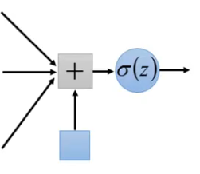

每个神经元的输出由其所有输入的非线性函数计算得出，该函数称为激活函数。每个连接处的信号强度由权重（weight）决定，在训练过程中学习的便是这个权重和偏差（bias，相当于常数的权重）。

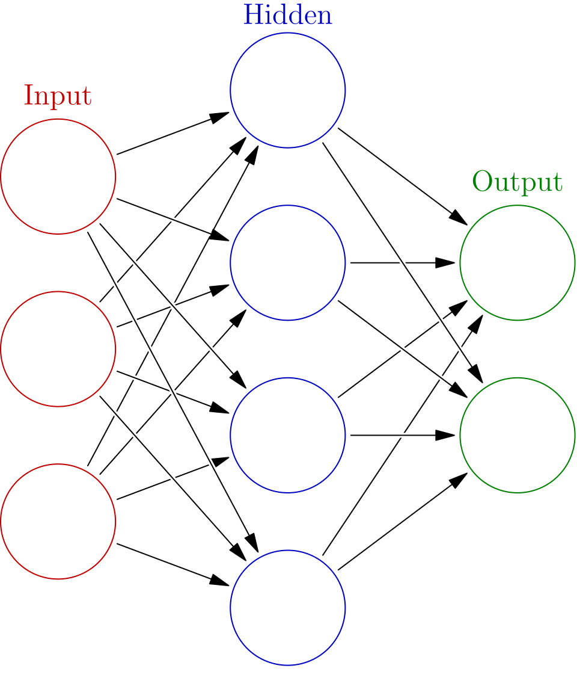

神经网络便是由不同神经元连接而成，而每个神经元又可以分为输入层，输出层，隐层（也有可能没有隐层）。

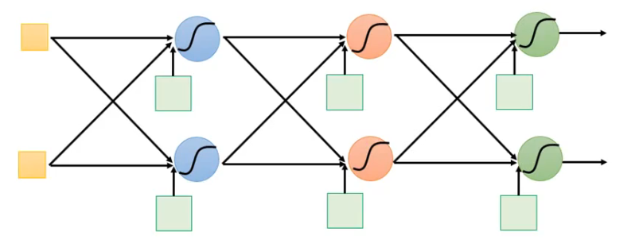

基于不同的方式，便可以得到不同的神经网络层（layer），如全连接层便是前一层的神经元与后一层的神经元两两之间互相连接。

深度学习（deep learning）的深，便是指有很多层隐层，如2012年提出的AlexNet（8层），2014年的VGG（19层），2014年的GoogleNet（22层），2015年的ResidualNet(152层，需要残差resNet，否者会导致梯度消失），当然，随着概念的不断泛化，只要是个神经网络，都叫做深度学习了。

### 矩阵（Matrix）
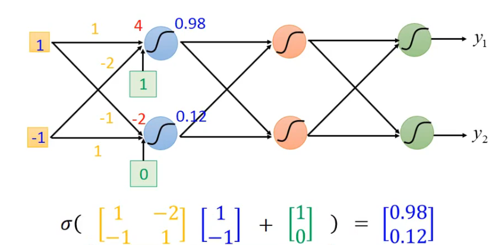
通常来说，每一层的神经网络，都会用一个一个矩阵进行表示，而输入输出则是一个向量。神经网络便是通过一层层神经网络计算得到新的output向量。GPU并行计算特别适合用来处理这种矩阵运算。

### 损失函数（Loss）
如何将让神经网络的输出接近自己的预期，需要计算所有测试用例的实际输出跟预期输出的差距loss，并找到一组合适的参数使得该差距最小。用于衡量真实值跟预期值之间的差距的函数就是损失函数。而用于找到最合适参数的方法就叫做梯度下降（gradient descent）。

#### 梯度下降
梯度下降，便是对所有涉及到的参数求偏导，然后用当前值减去偏导值得到新的参数（会乘上一个学习率
$$\alpha$$
，越大损失下降越快，最后也会越难收敛）。
偏导可以简单理解成真实值与预期值之间的变化快慢。
函数梯度表示函数最陡增长方向，沿着梯度方向走，增长最快，同理按着反方向走，下降最快。

更新公式：
$$w:=w-\alpha\frac{dJ(w,b)}{dw}, b:=b-\alpha\frac{dJ(w,b)}{db}$$

而反向传播算法（backpropagation），便是神经网络中最普遍使用的收敛梯度的算法。

### 导数
导数，直观来说就是函数在某一点的斜率。

#### 链式法则
对于函数j=f(u,v), u=f(a,b)，则有
$$\frac{dj}{da} =  \frac{dj}{du}\frac{du}{da}$$
，也就是说计算顺序从前往后，导数计算则是由后往前

## 逻辑回归（Logistic 回归）
逻辑回归是一个主要用于二分类的算法，给定一个样本x，输出该样本属于类别1的概率
$$\hat{y} = P(y=1|x)$$
使用的参数如下：
- **输入的特征向量**：
  $$x\in R^{n_x}$$
  ：一个
  $$n_x$$
  维的特征向量，用于训练的标签：
  $$y\in \{0,1\}$$
- **参数**：
权重：
$$w\in R^{n_x}$$
，偏置：
$$b\in R$$
- **输出预测结果**：
$$\hat{y} = \sigma(w^Tx+b)=\sigma(w_1x_1+w_2x_2+\dots +b) = \sigma(\theta^Tx)$$
   + **sigmoid函数**：
  $$s=\sigma(\theta^Tx)=\sigma(z)=\frac{1}{1+e^{-z}}$$
  z的值越大，结果越接近1，反之越接近0。

所有样本的损失函数需要求一个平均值
$$J(w,b)=\frac1m\sum^m_{i=1}L(\hat{y}^{(i)},y^{(i)})$$

### 逻辑回归损失函数
最简单的损失函数定义为平方差损失(线性回归一般使用该损失函数）：
$$L(\hat{y},y)=\frac12(\hat{y}-y)^2$$

逻辑回归则一般使用交叉熵损失函数
$$L(\hat{y},y)=-(y\log{\hat{y}})-(1-y)\log(1-\hat{y})$$
- y为1时
$$\hat{y}$$
必须越大，即越趋近于1
- y为0时
$$\hat{y}$$
必须越小，即越趋近于0

不使用平方差：存在多个局部最小点

### 逻辑回归的梯度下降

sigmoid函数的导数为
$$\sigma(z)(1-\sigma(z))$$
,记
$$\hat{y} = a = \sigma(z)$$
，则

$$dz = \frac{dJ}{dz} = \frac{dJ}{da} \frac{da}{dz} = (-\frac ya+\frac{1-y}{1-a})*a(1-a)=a-y$$

$$dw_i = \frac{dJ}{dz}\frac{dz}{dw_i} = (a-y)x_i$$

$$db = \frac{dJ}{dz}\frac{dz}{db} = a-y$$

伪代码实现

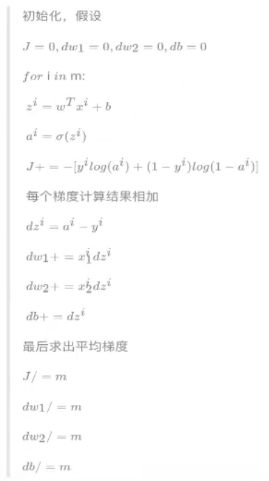

### 向量化编程
并行化计算，加速运算（numpy，如np.dot）

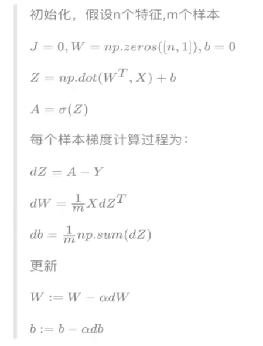

### 正向传播与反向传播
- 正向：从前往后计算梯度与损失
- 反向：从后往前计算参数的更新梯度值

### Case1：实现一个逻辑回归函数
https://github.com/xxxxxdy/AI_learning/blob/main/case/logistic_regression.py

## 浅层神经网络
单个样本

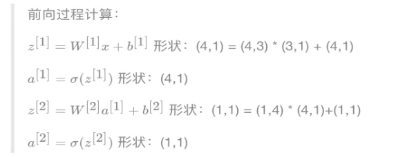

多个样本

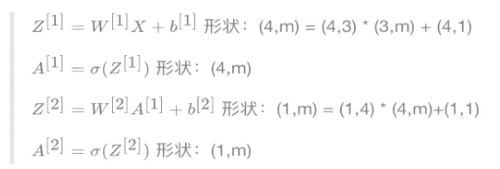

### 激活函数的选择

tanh函数（双曲正切函数）：效果比sigmoid好，输出值介于-1到1之间

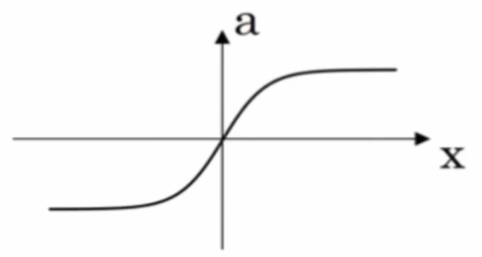

和sigmoid共同的缺点：当z值很大或者很小的时候，导数梯度趋于0，更新的程度非常下，训练非常慢

$$tanh(x) = \frac{e^x-e^{-x}}{e^x+e^{-x}} \\ $$
函数的导数:
$$1-tanh^2(x)$$

ReLU函数

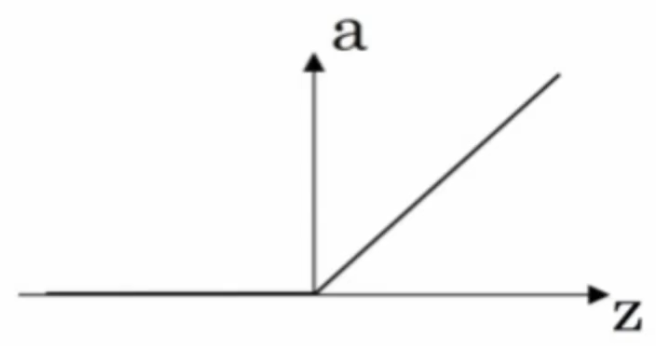

z>0时，梯度为1，收敛速度远快于tanh和sigmoid，z<0时梯度为0，在实际运用中，该缺陷影响不大。

Leaky ReLU (带泄露的ReLU）

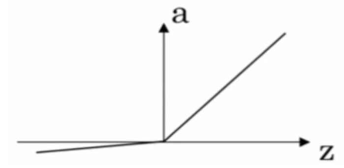

实际操作中没证明总是好于ReLU，不常用

#### 非线性的激活函数
若不适用非线性的激活函数，则输出都是输入的线性组合，与没有隐藏层效果相当，退化为最原始的感知器

### Case2：实现浅层神经网络
https://github.com/xxxxxdy/AI_learning/blob/main/case/shallow_nn.py

## 深层神经网络

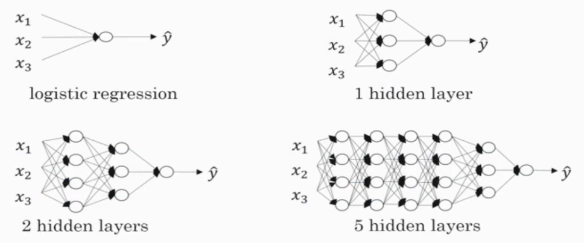

### 参数与超参数
- 参数：网络学习到的值
- 超参数：根据人经验判断设置的值
  - 学习率a
  - 迭代次数N
  - 隐藏层层数L
  - 每一层神经元个数n[i]
  - 激活函数g(z)

#### 参数初始化
如果初始化的时候将两个隐层神经元的参数设置为相同大小，那么在反向梯度下降计算的时候，会得到同样的梯度大小，经过多次迭代后，其值依然是一样的，对网络的影响是相同的。此时多个隐层神经元就没有意义了。权重W才有这个问题，偏置b不存在该问题可以初始化为0。

一般W初始化的时候值要尽可能的小（趋于0），越小梯度越大收敛越快。

## 多分类问题
### softmax回归
输出层的神经元个数必须为n，依次对应n个类别的具体概率。
需要对所有输出的结果进行一下softmax公式计算。

$$a_i^{[L]} = \frac{{e^{Z_i^{[L]}}}_{[L]}}{\sum_{i=1}^C e^{Z_i}}$$
且满足
$$\sum_{i=1}^C a_i^{[L]} = 1$$

### 交叉熵损失
跟二分类类似：
$$L(\hat{y}, y)=-\sum_{j=1}^Cy_j\log{\hat{y_j}}$$

总损失函数记为
$$J=\frac1m\sum_{i=1}^mL(\hat{y}, y)$$

### one hot 编码

其方法是使用N位状态寄存器来对N个状态进行编码，每个状态都有它独立的寄存器位，在任意时刻，只有一个值为1。

### Case3:Mnist 手写数字识别神经网络

https://github.com/xxxxxdy/AI_learning/blob/main/case/mnist_mlp.py

## 梯度下降算法改进
改进方向：快速训练模型，提高计算效率

### 梯度消失
梯度函数上出现的以指数级递增活递减的情况称作梯度爆炸/梯度消失。此时训练网络的难度也会随之上升，梯度下降算法的步长变得非常小，需要训练的时间非常长。

### 局部最优
函数存在多个极值点，但不是全局的最低点。

鞍点：函数导数为0，但不是局部极值的点。通常梯度为0的点是这些鞍点，导致减小损失的难度提高（而非局部最小点，在训练较大的神经网络，存在大量参数，且成本函数被定义在较高的空间维度时，困在局部最优点的情况基本不会发生）

### 解决方法：
1. 参数随机初始化（见上面）
2. Mini梯度下降法
3. 梯度下降方法的优化
4. 学习率衰减

#### Mini梯度下降算法

批（batch）梯度下降：同时处理整个训练集
- 缺点：迭代时间长，训练过程慢
- 优点：噪声低，函数总是朝着损失减小的方向下降

Mini梯度下降：每次同时处理固定大小的数据集

若mini-batch的大小为1 则是随机梯度下降法（stochastic gradient descent，sgd）
- 缺点：噪声多，总体趋势往全局最小值靠近，但是不会收敛，而是在最小值附近波动
- 优点：训练速度快，但是丢失了向量化带来的计算加速（GPU）

选择batch的大小：经验值 
样本较小时，如低于2000，则使用整个数据集 
样本较大时，则会使用2的幂次（与计算机信息存储方式相适应），如128，256，512，1024等

#### 指数加权平均
$$S_1=Y_1$$
$$S_i=\beta S_{i-1} + (1-\beta)Y_i$$

$$\beta$$
越大，数据越平滑，越滞后，这些系数叫做偏差修正。

#### 动量梯度下降法
gradient descent with momentum：
计算梯度的指数加权平均值，并利用该值来更新参数值。

$$S_{dW^{[l]}} = \beta S_{dW^{[l]}}+(1-\beta)dW^{[l]}$$
$$S_{db^{[l]}} = \beta S_{db^{[l]}}+(1-\beta)db^{[l]}$$
$$W^{[l]} := W^{[l]}-\alpha S_{dW^{[l]}}$$
$$b^{[l]} := b^{[l]}-\alpha S_{db^{[l]}}$$

每次更新的梯度值：幅度大，通过累加过去的梯度值来减小波动，从而加速收敛。
当前后梯度方向一致时，动量梯度下降能加速学习，不一致时，动量梯度下降能抑制震荡。

#### RMSProp 算法

Root Mean Square Prop算法，在对梯度进行指数加权平均的基础上，引入平方和平方根

$$s_{dW} = \beta s_{dW}+(1-\beta)(dW)^2$$
$$s_{db} = \beta s_{db}+(1-\beta)(db)^2$$
$$W := W-\alpha \frac{dW}{\sqrt{s_{dW}+\epsilon}}$$
$$b := b-\alpha \frac{db}{\sqrt{s_{db}+\epsilon}}$$

其中
$$\epsilon$$
是一个非常小的数，防止分母太小变得不稳定。当dw、db较大的时候，
$$\frac{db}{\sqrt{s_{db}+\epsilon}}$$
就会变得非常小

目的：对摆动限制更大，因此允许使用更大的学习率，从而加快学习速度

#### Adam算法
Adaptive Moment Estimation 自适应矩估计：结合上面两种方法

$$v_{dW} = \beta_1 v_{dW}+(1-\beta_1)dW$$
$$v_{db} = \beta_1 v_{db}+(1-\beta_1)db$$
$$v_{dW^{[l]}}^{corrected} = \frac{v_{dW^{[l]}}}{1-(\beta_1)^t}$$
$$s_{dW} = \beta_2 s_{dW}+(1-\beta_2)(dW)^2$$
$$s_{db} = \beta_2 s_{db}+(1-\beta_2)(db)^2$$
$$s_{db^{[l]}}^{corrected} = \frac{s_{db^{[l]}}}{1-(\beta_2)^t}$$

$$ W :=W-\alpha\frac{v_{dW^{[l]}}^{corrected}}{\sqrt{s_{s_{dW^{[l]}}^{corrected}}+\epsilon} $$
$$ b :=b-\alpha\frac{v_{db^{[l]}}^{corrected}}{\sqrt{s_{s_{dW^{[l]}}^{corrected}}+\epsilon} $$
