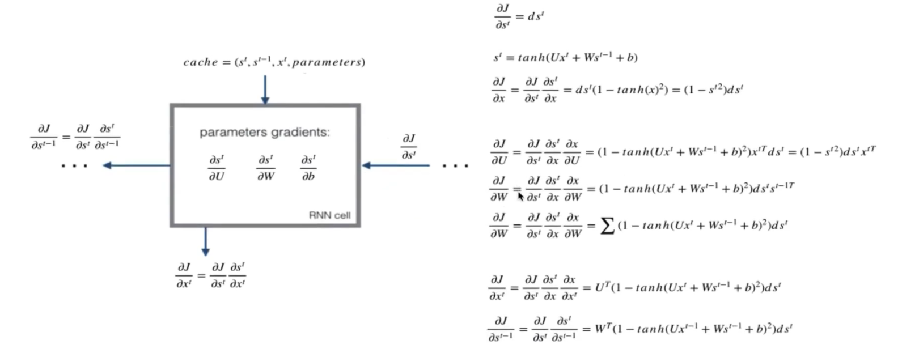
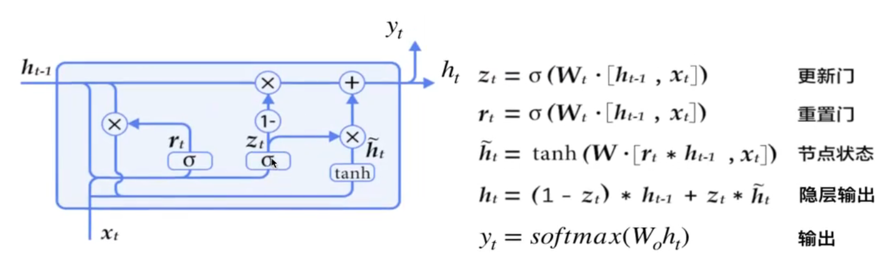
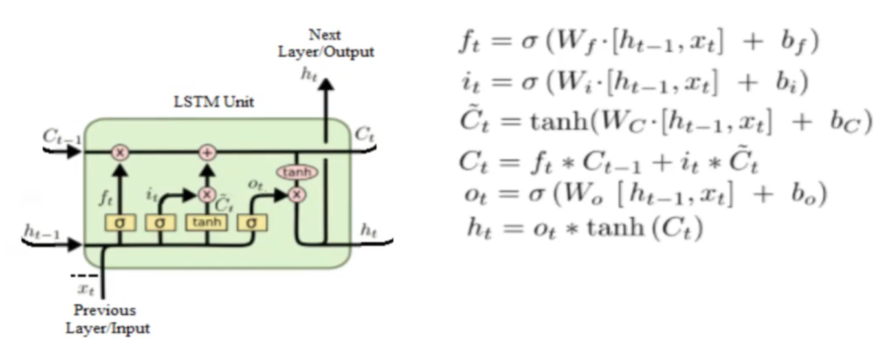
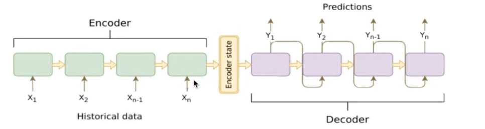
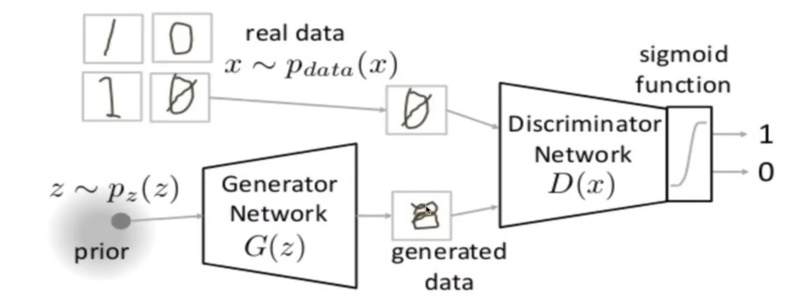
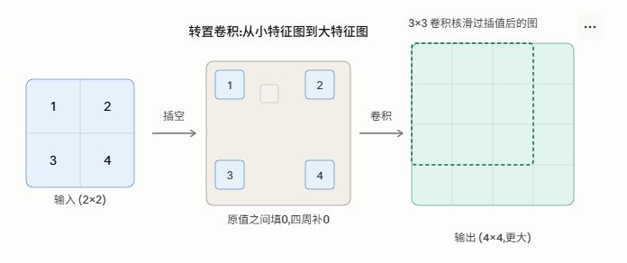
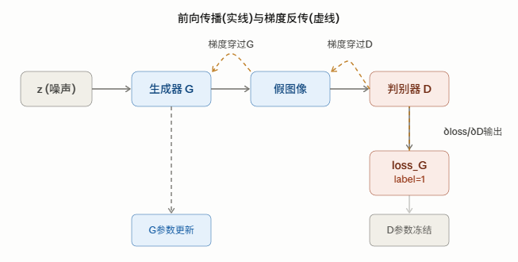

# 网络结构
## 卷积神经网络 CNN

卷积神经网络由一个或多个卷积层、池化层、与全连接层组成，在图像方面能得出更好的结果
### 图像数据与边缘检测
图片数据量巨大，在多层神经网络中达到瓶颈

### 感受野
边缘检测
卷积计算：逐元素乘积的累加。使用的矩阵叫做卷积核/过滤器filter

随着神经网络发展，与其使用人手工设计的过滤器，还可以将过滤器的数值作为参数，通过反向传播学习得到。

### 卷积层

目的：提取输入的不同特征

参数：
- size：卷积核/过滤器大小，通常有1\*1，3\*3，5\*5
- padding：零填充，Valid与Same
- stride：步长，默认为1

#### 卷积运算
卷积后的图片会变小：N-F+1，N为原始数据大小，F为卷积核大小 (步长为1）

问题：图片边缘信息会丢失

#### 零填充
在图片边缘用0进行填充（0在权重运算中对最终结果不造成影响，避免造成额外的干扰信息）

- Valid：不填充 N-F+1
- Same：保持图片大小不变 N+2P-F+1

奇数维度的过滤器：否则Same情况下填充不均匀（约定俗称的结果）

#### 步长
（N+2P-F）/S+1

### 多通道卷积

输入数据有多个通道（channel），如彩色图片RGB，卷积核要有相同的Channel数

### 池化层
对卷积层学习到的特征图进行一个亚采样（subsampling）
- 最大池化：max pooling 取窗口内最大值作为输出
- 平均池化：avg pooling 取窗口内所有值的均值作为输出

目的：
- 降低网络输入维度，缩减模型大小，提高计算速度
- 提高feature map的稳定性，防止过拟合

超参数f：2*2 窗口大小 s=2 步长

特点：没有参数，不需要学习

### 全连接层
- 对所有的Feature Map进行扁平化（flatten，reshape成1*N的向量）
- 再连接一个或多个全连接层，进行模型学习

### 经典分类卷积网络结构

#### LeNet-5

激活层默认不体现，该网络使用的是sigmoid和tanh函数，
卷积、激活、池化视作一层，即使池化没有参数

2层卷积+2层全连接+1层output

中间的特征大小变化不宜过快

#### AlexNet

- 5层卷积+3层全连接
- 激活函数ReLU
- 防止过拟合：dropout，数据扩充
- 批标准化层

计算量大（6000万参数）

### 卷积网络结构优化

AlexNet-MIN-（VGG-GoogleNet）-ResNet

MIN:引入1*1卷积

VGG:网络深度加深 1.4亿参数（大部分参数在全连接层）

GoogleNet：500万参数，更多卷积、更深层次得到更好的结构，引入了Inception模块

#### Inception结构

提出MLP卷积代替传统线性卷积核。传统线性卷积核：采用线性滤波器，然后使用非线性激活

1*1的卷积核：
- 配合激活函数，将多通道的feature map由多通道的线性组合编程非线性组合，提高特征抽象能力（Multilayer Perceptron， MLP）
- 实现卷积核通道数的降维和升维，实现参数的减小化

Inception结构：代替人手工确认使用的卷积核大小与是否需要池化层，由网络自己去寻找合适的结构，并节省计算

使用多种卷积核进行运算合并结果通道数

网络缩小后再扩展

#### 卷积网络特征可视化

NA

### 迁移学习
利用数据、任务或者模型间的相似性，将在旧的领域学习过或训练好的模型，运用到新的领域中

两个任务的输入属于同一性质

迁移学习需要考虑的：
- 训练数据
- 训练成本

#### 微调fine tuning
已经训练好的模型 pre-trained model

修改并通过代码建立自己的模型，加载原模型的参数
- 若数据较多，freeze模型一部分
- 若数据较少，freeze全部参数，只训练输出层

## 循环神经网络 RNN

### 序列模型
自然语言、音频、视频等

情感分类、语音识别、机器翻译等

1. 前后输入有很强的关联性
2. 输入输出长度不确定

### 机器学习类型

- 一对一：图像分类
- 一对多：图像识别
- 多对一：情感分析
- 多对多：机器翻译
- 同步多对多：文本、视频生成，也称序列生成

### 网络结构

- xt:每个时刻的输入
- ot：每个时刻的输出
- st：每个隐层的输出
- 所有单元的参数共享

$$ s_0=0 $$
$$s_t=g 1\left(U x_{t}+W s t-1+b_{a}\right) $$
$$o_{t}=g 2\left(V s_{t}+b_{y}\right)$$

有两个输入参数， 前一个cell的状态和当前输入
有两个输出，当前cell的状态和当前输出

矩阵U是n\*m的，矩阵W是n\*n的，m是词的个数，n是输出的维度（cell的状态）

#### 词的表示

one-hot编码，建立一个包含所有词的词库（包括起始结束符），每个词都是一个长度等于词库大小的向量

输出：softmax

### 交叉熵损失
总误差是各个时刻的词的误差之和

$$\begin{array}{l}
E_{t}(y t, \hat{y t})=-y_{t} \log (\hat{y t}) \\
E(y, \hat{y})=\Sigma_{t} E_{t}\left(y_{t}, \hat{y_{t}}\right)=-\sum_{t} y_{t} \log \left(\hat{y_{t}}\right)
\end{array}$$

#### 时序反向传播算法BPTT back propagation through time

 每个时间的梯度都计算出来，然后累加，步骤：
 1. 计算最后一个时刻的交叉熵损失对于s_t的梯度,记忆交叉熵损失对于s_t,V,by的导数
 2. 前一个cell计算：
    - 计算当前层损失对于当前隐层状态输出值s_t的梯度+上一层相对于s_t的损失
    - 计算tanh激活函数的导数
    - 计算Ux_t+Ws_{t-1}+b_a对于不同参数的导数

同样存在梯度消失与梯度爆炸的问题

#### Case：简易RNN网络实现
https://github.com/xxxxxdy/AI_learning/blob/main/case/simple_rnn.py

### GRU 门控循环单元

GRU增加了两个门，重置门reset gate和更新门update gate
- 重置门决定如何将新的输入信息与当前记忆相结合
- 更新们定义了前面记忆保存到当前时间步的量
- 若重置门设为1更新门设为0，将再次获得标准RNN模型

目的：解决短期记忆问题，每个递归单元能够自适应捕捉不同尺度的依赖关系

为了解决梯度消失问题，在隐层输出的地方h_t, h_{t-1}的关系用加法而不是RNN中的乘法+激活函数

### LSTM 长短记忆网络

三个门：遗忘门f，更新门u，输出门o

目的：记忆更长距离的时间状态

### 词嵌入与NLP

One-hot编码：整体大小太大，没能体现出词语之间的关系

词嵌入：把一个维数为所有词的数量的高维空间嵌入到一个维数低得多的连续向量空间中，每个单词或词组被映射为实数域上的向量（通常为30-500维）

特点：能够体现词与词之间的关系，能够得到相似词

算法类别：word2vec：skip-gram、CBOw等

## seq2seq与Attention机制

seq2seq是一个encoder-decoder结构的网络，输入是一个序列，输出也是一个序列。
encoder是把一个可变长度的信号序列变为固定长度的向量表达，
decoder是把固定长度的向量变为可变长度的目标的信号序列

### 条件语言模型理解

$$argmaxP(y1,\dots, tT' | x1,\dots, xT)$$
给定输入的序列，使得输出序列的概率值最大

最大似然估计，最大化输出序列的概率

$$P\left(y 1, \ldots, yT{\prime} \mid x{1}, \ldots, x{T}\right)=\prod ^{T{\prime}}_{t{\prime}=1} P\left(y t{\prime} \mid y_1, \ldots, y t{\prime}-1, x{1}, \ldots, x{T}\right)=\prod ^{T{\prime}}_{t{\prime}=1}P\left(y t^{\prime} \mid y 1, \ldots, y t{\prime}-1, C\right)$$

这些概率的连乘结果会非常小，不利于计算存储，需要取对数

$$\log P\left(y 1, \ldots, yT{\prime} \mid x{1}, \ldots, x{T}\right)= \sum^{T{\prime}}_{t{\prime}=1}\log P\left(y t{\prime} \mid y 1, \ldots, y t{\prime}-1, C\right)$$

可以看作是输出结果通过softmax变成概率最大，而损失最小的问题，输出序列损失化最小

### 机器翻译
集束搜索 beam search

pass

## 注意力机制

### 长句子问题
encoder-decoder结构中，encoder把所有输入序列都编码成一个统一的语义特征C再解码，因此，C中必须包含原始序列中的所有信息，其长度就成了限制模型性能的瓶颈

Attention：建立encoder的隐层状态输出到decoder对应输出y所需要的上下文信息->增加编码器信息输入到解码器中相同时刻的联系，其他时刻信息减弱

记encoder的时间为t，decoder的时间为t'

$$c_{t{\prime}} = \sum^T_{t=1}\alpha_{t{\prime}t}h_t$$

$$\alpha_{t{\prime}t}$$
为在网络中训练得到的参数

$$\alpha_{t{\prime}t} = \frac{exp(e_{t{\prime}t})}{\sum^T_{k=1} exp(e_{t{\prime}k})}$$

$$e_{t{\prime}t} = g(s_{t\prime-1}, h_t)=v^T tanh(W_ss+W_hh)$$

$$e_{t{\prime}t}$$
是由t时刻的编码器隐层状态输出和解码器
$${t\prime-1}$$
时刻的隐层状态输出计算出来的

s是解码器隐层状态输出，h是编码器隐层状态输出

v,W_s，W_h 都是网络学习的参数

## GAN网络

非监督学习：生成以假乱真的图片

生成对抗网络 Generative Adversarial Network

生成器 Generator：输入噪点数据生成固定大小的图片
判别器 Discriminator：训练样本，判别生成图片的真伪

思想：从训练库中获取很多训练样本，从而学习这些训练案例生成的概率分布

流程：
1. 建立GAN结构，真实数据与假数据样本分布差异大
2. 训练判别器，使得能够区分真假样本，生成器不动
3. 训练生成器，使得生成假样本能接近真实样本的分布

训练损失
$$\min _{G} \max _{D} V(D, G)=\mathbb{E}_{\boldsymbol{x} \sim p_{\text {data }}(\boldsymbol{x})}[\log D(\boldsymbol{x})]+\mathbb{E}_{\boldsymbol{z} \sim p_{\boldsymbol{z}}(\boldsymbol{z})}[\log (1-D(G(\boldsymbol{z})))]$$

V(D,G)表示真实图片和生成图片的差异程度

本质上只是一个二分类问题，使用交叉熵损失

网络结构
- 2014刚开始：G、D都是MLP，训练难度大，效果一般
- 2015：卷积神经网络+GAN DCGAN Deep Convolutional GAN
  - D中取出pooling，全部变成卷积，生成器G中使用反卷积
  - DG中使用了BN层
  - 去掉了全连接层
  - D中全部使用Leaky ReLU，G中除了最后的输出层使用tanh其他层都换成ReLU

### case：GAN生成mnist手写数字
https://github.com/xxxxxdy/AI_learning/tree/main/case/GAN

## Auto Encoder

自编码器：数据去噪，可视化降维

一种数据的压缩算法，使用神经网络学习数据值编码的无监督方式

损失：encoder和decoder的误差衡量

- 普通自编码器
- 多层自编码器
- 卷积自编码器
- 正则化自编码器

  
## CapsuleNet

CNN通过“池化（Pooling）”操作来获得平移不变性。但这个过程会丢失精确的位置和空间关系信息。CNN只看“有什么特征”，而忽略了“这些特征是怎么排列的”。

- 传统神经元：输出一个标量（一个数字），比如“0.9”，代表检测到某个特征的概率。
- 胶囊（Capsule）：是一组神经元，它输出一个向量（一组数字）。这个向量的长度代表特征存在的概率，而向量的方向则编码了特征的姿态参数，如精确的位置、旋转角度、大小等。

简单来说，如果输入的图像旋转了30度，CNN的输出可能不变（因为它设计为不变性），而胶囊网络的输出向量会相应地旋转30度，但其模长（代表概率的部分）保持不变。这使得它对几何变换有更强的理解能力。

