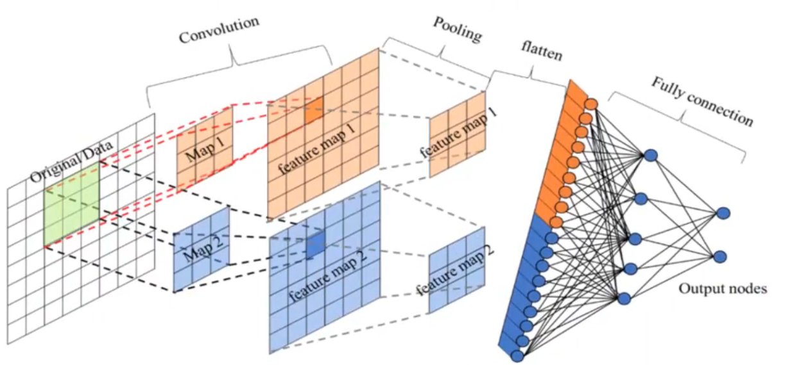
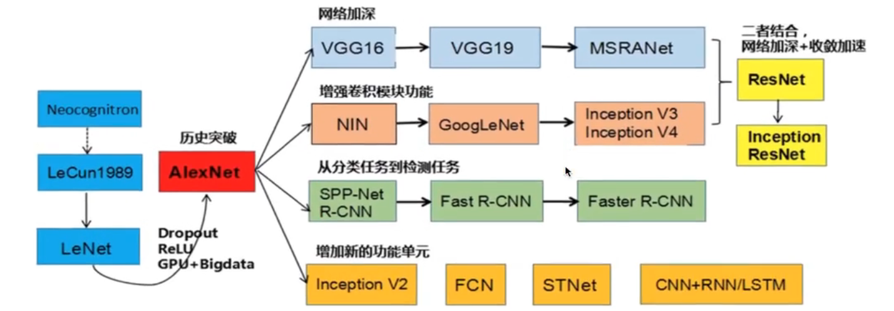
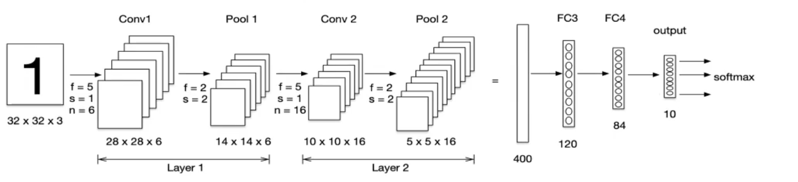
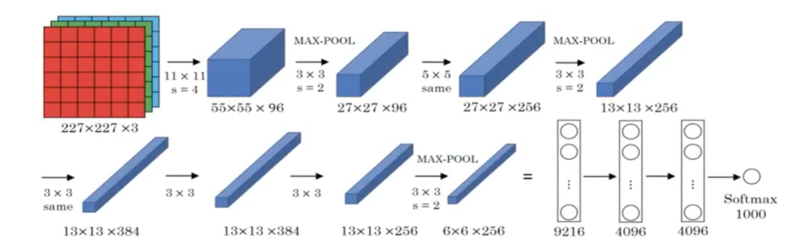
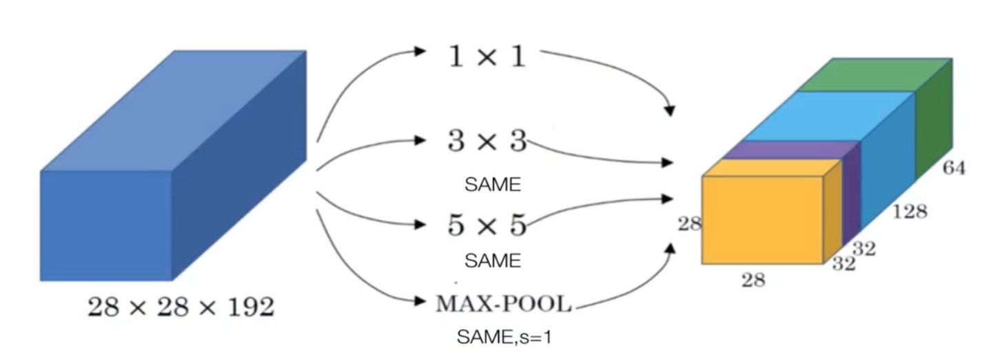
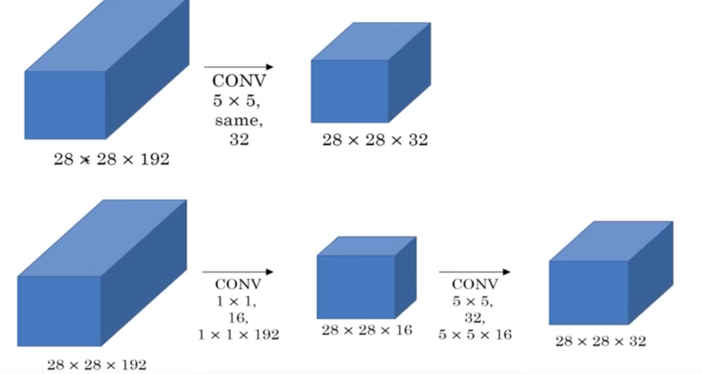
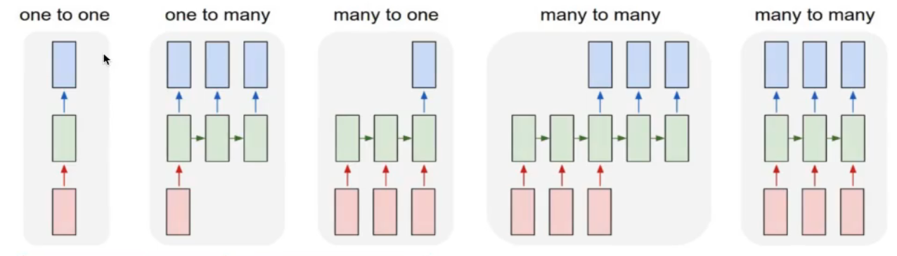
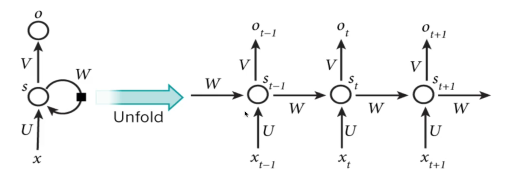

# 网络结构
## 卷积神经网络 CNN

卷积神经网络由一个或多个卷积层、池化层、与全连接层组成，在图像方面能得出更好的结果
### 图像数据与边缘检测
图片数据量巨大，在多层神经网络中达到瓶颈

### 感受野
边缘检测
卷积计算：逐元素乘积的累加。使用的矩阵叫做卷积核/过滤器filter

随着神经网络发展，与其使用人手工设计的过滤器，还可以将过滤器的数值作为参数，通过反向传播学习得到。

### 卷积层

目的：提取输入的不同特征

参数：
- size：卷积核/过滤器大小，通常有1\*1，3\*3，5\*5
- padding：零填充，Valid与Same
- stride：步长，默认为1

#### 卷积运算
卷积后的图片会变小：N-F+1，N为原始数据大小，F为卷积核大小 (步长为1）

问题：图片边缘信息会丢失

#### 零填充
在图片边缘用0进行填充（0在权重运算中对最终结果不造成影响，避免造成额外的干扰信息）

- Valid：不填充 N-F+1
- Same：保持图片大小不变 N+2P-F+1

奇数维度的过滤器：否则Same情况下填充不均匀（约定俗称的结果）

#### 步长
（N+2P-F）/S+1

### 多通道卷积

输入数据有多个通道（channel），如彩色图片RGB，卷积核要有相同的Channel数

### 池化层
对卷积层学习到的特征图进行一个亚采样（subsampling）
- 最大池化：max pooling 取窗口内最大值作为输出
- 平均池化：avg pooling 取窗口内所有值的均值作为输出

目的：
- 降低网络输入维度，缩减模型大小，提高计算速度
- 提高feature map的稳定性，防止过拟合

超参数f：2*2 窗口大小 s=2 步长

特点：没有参数，不需要学习

### 全连接层
- 对所有的Feature Map进行扁平化（flatten，reshape成1*N的向量）
- 再连接一个或多个全连接层，进行模型学习

### 经典分类卷积网络结构

#### LeNet-5

激活层默认不体现，该网络使用的是sigmoid和tanh函数，
卷积、激活、池化视作一层，即使池化没有参数

2层卷积+2层全连接+1层output

中间的特征大小变化不宜过快

#### AlexNet

- 5层卷积+3层全连接
- 激活函数ReLU
- 防止过拟合：dropout，数据扩充
- 批标准化层

计算量大（6000万参数）

### 卷积网络结构优化

AlexNet-MIN-（VGG-GoogleNet）-ResNet

MIN:引入1*1卷积

VGG:网络深度加深 1.4亿参数（大部分参数在全连接层）

GoogleNet：500万参数，更多卷积、更深层次得到更好的结构，引入了Inception模块

#### Inception结构

提出MLP卷积代替传统线性卷积核。传统线性卷积核：采用线性滤波器，然后使用非线性激活

1*1的卷积核：
- 配合激活函数，将多通道的feature map由多通道的线性组合编程非线性组合，提高特征抽象能力（Multilayer Perceptron， MLP）
- 实现卷积核通道数的降维和升维，实现参数的减小化

Inception结构：代替人手工确认使用的卷积核大小与是否需要池化层，由网络自己去寻找合适的结构，并节省计算

使用多种卷积核进行运算合并结果通道数

网络缩小后再扩展

#### 卷积网络特征可视化

NA

### 迁移学习
利用数据、任务或者模型间的相似性，将在旧的领域学习过或训练好的模型，运用到新的领域中

两个任务的输入属于同一性质

迁移学习需要考虑的：
- 训练数据
- 训练成本

#### 微调fine tuning
已经训练好的模型 pre-trained model

修改并通过代码建立自己的模型，加载原模型的参数
- 若数据较多，freeze模型一部分
- 若数据较少，freeze全部参数，只训练输出层

## 循环神经网络 RNN

### 序列模型
自然语言、音频、视频等

情感分类、语音识别、机器翻译等

1. 前后输入有很强的关联性
2. 输入输出长度不确定

### 机器学习类型

- 一对一：图像分类
- 一对多：图像识别
- 多对一：情感分析
- 多对多：机器翻译
- 同步多对多：文本、视频生成，也称序列生成

### 网络结构

- xt:每个时刻的输入
- ot：每个时刻的输出
- st：每个隐层的输出
- 所有单元的参数共享

$$ s_0=0 $$
$$s_t=g 1\left(U x_{t}+W s t-1+b_{a}\right) $$
%%o_{t}=g 2\left(V s_{t}+b_{y}\right)$$
