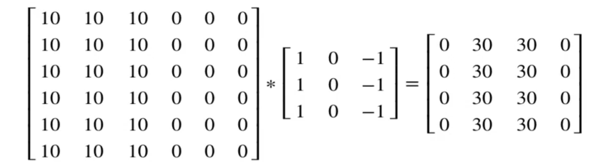
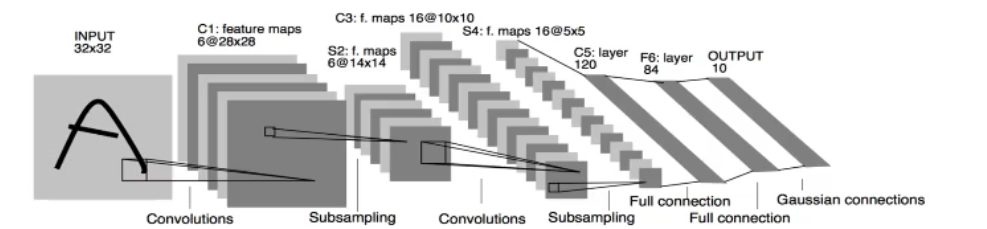

# 网络结构
## 卷积神经网络 CNN

卷积神经网络由一个或多个卷积层、池化层、与全连接层组成，在图像方面能得出更好的结果
### 图像数据与边缘检测
图片数据量巨大，在多层神经网络中达到瓶颈

### 感受野
边缘检测
卷积计算：逐元素乘积的累加。使用的矩阵叫做卷积核/过滤器filter

随着神经网络发展，与其使用人手工设计的过滤器，还可以将过滤器的数值作为参数，通过反向传播学习得到。

### 卷积层

目的：提取输入的不同特征

参数：
- size：卷积核/过滤器大小，通常有1\*1，3\*3，5\*5
- padding：零填充，Valid与Same
- stride：步长，默认为1

#### 卷积运算
卷积后的图片会变小：N-F+1，N为原始数据大小，F为卷积核大小 (步长为1）

问题：图片边缘信息会丢失

#### 零填充
在图片边缘用0进行填充（0在权重运算中对最终结果不造成影响，避免造成额外的干扰信息）

- Valid：不填充 N-F+1
- Same：保持图片大小不变 N+2P-F+1

奇数维度的过滤器：否则Same情况下填充不均匀（约定俗称的结果）

#### 步长
（N+2P-F）/S+1

### 多通道卷积

输入数据有多个通道（channel），如彩色图片RGB，卷积核要有相同的Channel数

### 池化层
对卷积层学习到的特征图进行一个亚采样（subsampling）
- 最大池化：max pooling 取窗口内最大值作为输出
- 平均池化：avg pooling 取窗口内所有值的均值作为输出

目的：
- 降低网络输入维度，缩减模型大小，提高计算速度
- 提高feature map的稳定性，防止过拟合

超参数f：2*2 窗口大小 s=2 步长

特点：没有参数，不需要学习

### 全连接层
- 对所有的Feature Map进行扁平化（flatten，reshape成1*N的向量）
- 再连接一个或多个全连接层，进行模型学习

